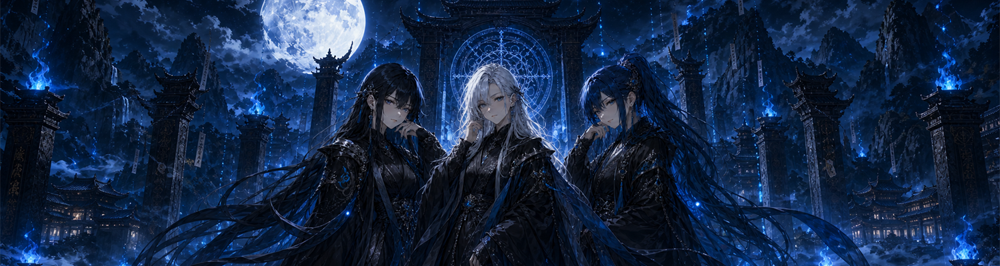

  
   

  
  
  
  
  

  <h3>STACK</h3>

<table align="center">
  <tr>
    <td align="center" width="110"> <b>Kotlin</b></td>
    <td align="center" width="110"> <b>Java</b></td>
    <td align="center" width="110"><picture><source media="(prefers-color-scheme: dark)" srcset="assets/stack/rust-white.svg" /></picture> <b>Rust</b></td>
    <td align="center" width="110"> <b>Gradle</b></td>
    <td align="center" width="110"> <b>Actions</b></td>
    <td align="center" width="110"> <b>PowerShell</b></td>
  </tr>
</table>

<!-- Original icons: devicons/devicon@7330accdbc47e2dc0c19789a48533c4a3c50fe58 -->

  <h3>STATS</h3>
  

  

  <h3>ACHIEVEMENTS</h3>
  

 

  

